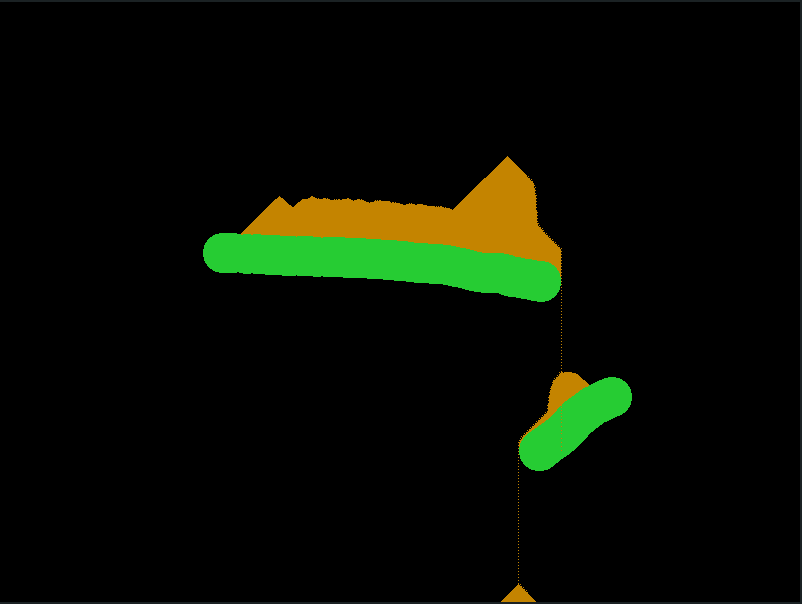

# fragmentSand
A OpenGL fragment shader based 2D falling sand simulator game.

## Getting started

To run this program you need cmake installed (and maybe some OpenGL things depending on your OS).
Make a build folder, and from there call "cmake ." and "cmake --build .". Then run the "sand" binary.

## Example

## Built With

* [glad]( https://github.com/Dav1dde/glad ) - For OpenGL api.
* [glfw]( https://www.glfw.org/docs/3.3/index.html ) - For OS independent window management.
* [glm]( https://glm.g-truc.net/0.9.4/index.html ) - For math related things.
* [CMake]( https://cmake.org/cmake/help/v3.13/index.html ) - For building.

## Contributing

There are no people other than the author contributing to this project (yet(?)).

## Author

* **Heinich Porro** - *Initial work* - [hporro](https://github.com/hporro)

[//]: # "See also the list of [contributors](https://github.com/hporro/fragmentSand/contributors) who participated in this project."

## Licence
